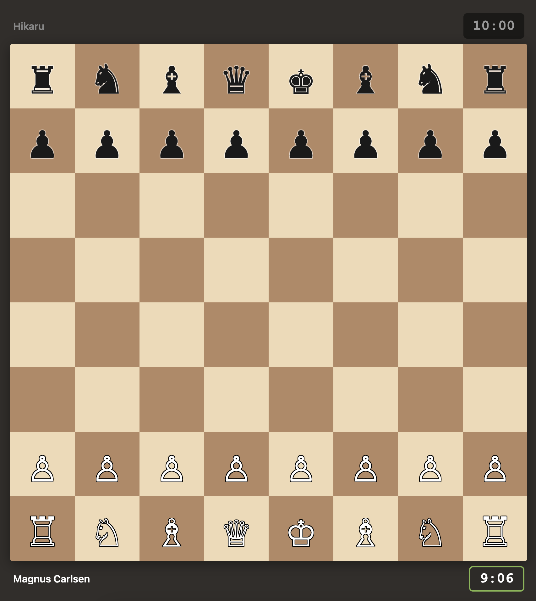

# Chess Online

A real-time chess web app for playing over LAN. No account needed — just start the server, share the room code, and play.



## Features

- **LAN multiplayer** — play with anyone on your local network
- **Room-based matchmaking** — create a room, share the 6-character code
- **Color selection** — both players race to pick White or Black
- **Configurable time control** — 1, 3, 5, 10, 15, or 30 minute games
- **Server-authoritative clock** — no client-side cheating
- **Full chess rules** — castling, en passant, promotion, check/checkmate/stalemate detection
- **In-game chat**
- **Resign and rematch** — colors swap on rematch
- **Responsive UI** — works on iPhone, iPad, and laptop
- **Sound effects** on moves and captures

## Getting Started

```bash
npm install
npm start
```

The server starts on port 3000 and shows your LAN address:

```
Chess server running!

  Local:   http://localhost:3000
  LAN:     http://192.168.1.x:3000
```

Open the Local URL on your machine and share the LAN URL with your opponent.

## How to Play

1. Enter your name and **Create Room**
2. Share the room code with your opponent
3. Opponent enters the code and clicks **Join**
4. Both players pick their color (first pick wins) and time control
5. Play!

## Tech Stack

- **Express** + **Socket.IO** — real-time game server
- **Custom chess engine** — move generation, validation, and game state (browser-side)
- Vanilla HTML/CSS/JS — no frontend framework needed

## License

ISC
